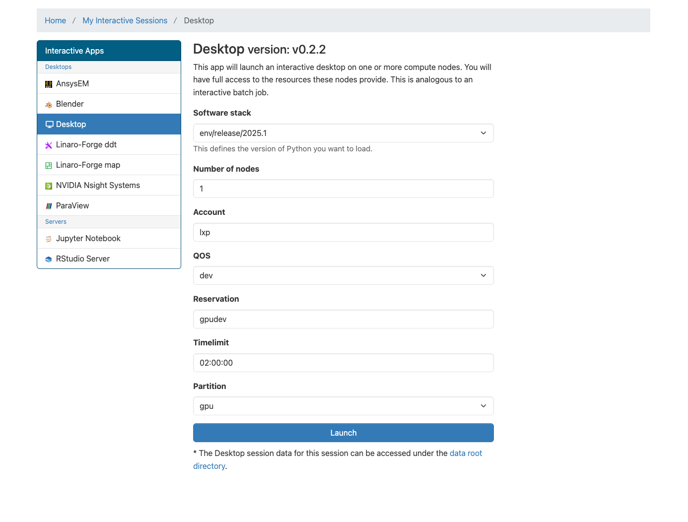
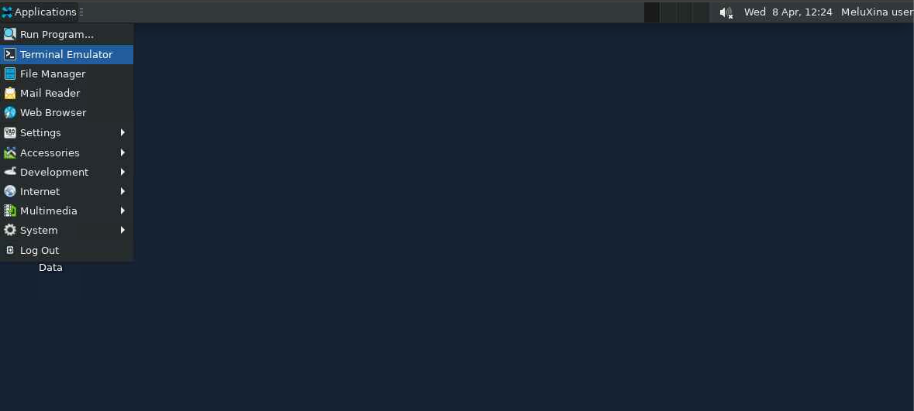

# Speakers


<!-- _footer:  -->

<!-- _class: lead -->

# Understanding why your GPU-accelerated is slow using NVIDIA Nsight Systems
Apr 15, 2026 | 1:20 PM - 3:00 PM


___
# Presenters 

<!-- _class: lead -->

<div class="speaker-row">
  
  
</div>

<div class="speaker-caption">
  Marco Magliulo &nbsp;&nbsp;|&nbsp;&nbsp; Tom Walter
</div>


---

# Goal of this workshop

By the end, you should be able to:

- Profile your GPU jobs on Meluxina
- Interpret key trace metrics and timelines  
- Identify common GPU bottlenecks (IO, compute, memory, synchronization, communication)  
- Apply simple optimizations and validate improvements  

---

## Agenda 

- Connection to Meluxina via OpenOnDemand
- Introduction to NVIDIA NSight-Systems
- Hands-on: making a PyTorch Training faster
  - distributing it 
  - making it faster


---

<!-- _class: lead -->

# Connecting to Meluxina via OpenOnDemand 


---
# https://portal.lxp.lu/


---
# Openning the Desktop app 


---
# Choosing the appropriate job options 



---
# Accessing the session


---
# Openning the terminal app




---

<!-- _class: lead -->

# Getting the code  


---
# Going to the project folder 


```bash
$ cd /project/home/p201259/workspaces/ 
$ mkdir -p $USER/ScynergyGPUProfiling2026 
$ cd $USER/ScynergyGPUProfiling2026
```

---
# Cloning the repo

```bash
$ git clone https://github.com/LuxProvide/Scynergy2026-GPUApplicationProfiling
$ cd ScynergyGPUProfiling2026/
```

---
##  Key Questions Answered via Profiling

- **CPU/IO Bottlenecks:** Is the GPU idle during data loading?
- **Data Movement:** Do H2D transfers dominate compute time?
- **Compute vs. Memory:** bandwidth-bound or compute-bound?
- **Multi-GPU Scaling:** Is there load imbalance across ranks?
- **Sync Stalls:** Are MPI/NCCL/Barriers causing idleness?
- **Launch Overhead:** Are kernels too small or frequent?
- **Occupancy:** Is register/SRAM usage limiting parallelism?

---

# Why Measuring/profiling GPU code?

- Wall‑clock runtime alone doesn’t explain *why* a job is slow
- GPU programming adds complexity:
  - Host ↔ device transfers
  - Kernel launches and occupancy
  - Memory hierarchy (global / shared / L2 / registers)

---

# NVIDIA Nsight tool family

- **Nsight Systems**
  - System‑wide timeline (CPU, GPU, MPI, I/O)
  - Good for: *“Where is the time going?”*
- **Nsight Compute**
  - Kernel‑level analysis and metrics
  - Good for: *“Why is this kernel so slow?”*

Today focus on **Nsight Systems** 

---

# Usual workflow

1. **Reproduce the problem** with a smaller test case
2. Run **Nsight Systems** on this smaller test case
3. Identify **top time consumers** in the timeline
4. Formulate hypotheses → apply changes → re‑profile
5. Repeat until performance is satisfactory 


---

# High-level workflow: Running Nsight on MeluXina 

Two main steps:
- Nsight-Systems produces a trace (`.nsys-rep` extension)
- We use the GUI of Nsight-Systems and its command line tools to analyze this trace 

---

# Our workflow for today 

For the ease of use, we are going to use OpenOnDemand.
We will then be able to:
- Open `Nsight-Systems` GUI to analyze traces already prepared for you,
- We will also use the rich `nsys` command line tools
- Modify the code, profile, adjust, start again

--- 

# First step: open a trace

```bash
```

---

# Example: Nsight Systems on MeluXina

Basic pattern:

```bash
nsys profile \
  -o profile_gpu_app \
  --stats=true \
  ./your_gpu_application [args...]
```

Or inside a Slurm script:

```bash
srun nsys profile -o profile_gpu_app ./your_gpu_application
```

- Generates `profile_gpu_app.nsys-rep`
- Analyze offline with:
  - `nsys stats profile_gpu_app.nsys-rep`
  - Nsight Systems GUI on your workstation


---

# Common GPU performance issues

- Low GPU utilization / long CPU‑only phases
- Many tiny kernel launches (launch overhead dominated)
- Poor memory access patterns:
  - Non‑coalesced global memory
  - Excessive host↔device copies
- Low occupancy:
  - Too many registers per thread
  - Too small block sizes
- Imbalance across GPUs in multi‑GPU jobs

---

# Reading a typical Nsight timeline

Look for:

- **Gaps** on GPU lanes:
  - Is GPU idle while CPU is busy?
- **Memcpy spikes**:
  - Large or frequent data transfers?
  - Transfers overlapping with compute?
- **Kernel launch bursts**:
  - Many short kernels → consider kernel fusion or batching
- Alignment with:
  - MPI calls
  - File I/O
  - Synchronizations (barriers, `cudaDeviceSynchronize()`)

---

# From symptoms to hypotheses

Examples:

- Symptom: GPU idle, long CPU regions
  - Hypothesis: work not offloaded / blocked by synchronization
- Symptom: memcpy time dominant
  - Hypothesis: data layout / transfer strategy suboptimal
- Symptom: one kernel dominates runtime
  - Hypothesis: micro‑optimizing that kernel may yield large gains
- Symptom: low occupancy, many stalls
  - Hypothesis: tune block size, shared memory usage, loop structure

---

# Using Nsight Compute metrics

Key metrics to check (conceptually):

- **Achieved occupancy**  
- **DRAM throughput** vs peak  
- **L2 / L1 / shared memory hit rates**  
- **Warp stall reasons** (e.g. memory dependency, execution dependency, barrier)  
- **Instruction throughput** (FP32/FP64, tensor core utilization)

These guide whether you should:
- Focus on memory access patterns
- Reduce divergence / control flow issues
- Adjust launch configuration

---

# Workflow on MeluXina (summary)

1. Prepare a **representative but smaller** test case  
2. Request GPU node(s) via Slurm  
3. Run Nsight Systems for a **global view**  
4. Identify 1–3 **hot kernels**  
5. Run Nsight Compute targeted at those kernels  
6. Implement optimizations → re‑run benchmarks  
7. Once satisfied, scale back up to full production sizes

---

# Practical tips

- Start with **short profiling runs** to reduce overhead  
- Use **environment modules** to load correct CUDA/Nsight versions  
- Keep **profiling configs** (scripts, flags) in version control  
- Always compare **before vs after** with the same test case  
- Document:
  - What you changed
  - Which metrics improved
  - Any trade‑offs (e.g. memory vs speed)

---

# Hands‑on exercise (if time permits)

- We’ll take a simple GPU‑accelerated mini‑app  
- Steps:
  - Baseline run: measure runtime
  - Nsight Systems profile: inspect timeline
  - Nsight Compute: inspect top kernel
  - Apply 1–2 optimizations (e.g. block size, memory layout)
  - Re‑profile and discuss results

---

# What you can do after this workshop

- Apply Nsight to your **own applications** on MeluXina  
- Build a small **profiling checklist** for new codes  
- Share **profiling results** with colleagues to guide optimization  
- Reach out to support / performance teams with:
  - Profiles
  - Clear descriptions of bottlenecks

---

# Q & A

Questions, specific applications, or issues you’d like to discuss?

---

# Thank you

- Slides and example scripts:  
  - (Add link / repository here)
- Contact:  
  - Your email / group contact


---

<!-- _class: lead -->

# Back-up slides  

---

# Meluxina GPU node Hardware 

- CPU: 2× AMD 7452 EPYC ROME CPUs: 32 cores each
- GPUs:
    - 4× NVIDIA A100 GPUs on each node
      - 40 GB HBM2 each (the so-called VRAM)
    - NVLink between GPUs **of the same node**
- ~512 GB RAM 

---

# Meluxina GPU node Hardware 

- Storage / FS
    - Parallel filesystem (Lustre) for scratch/project storage
    - Local SSD for node‑local temporary data ~1.8 Tb 
- High‑speed HDR/InfiniBand (200 Gb/s ) between nodes
