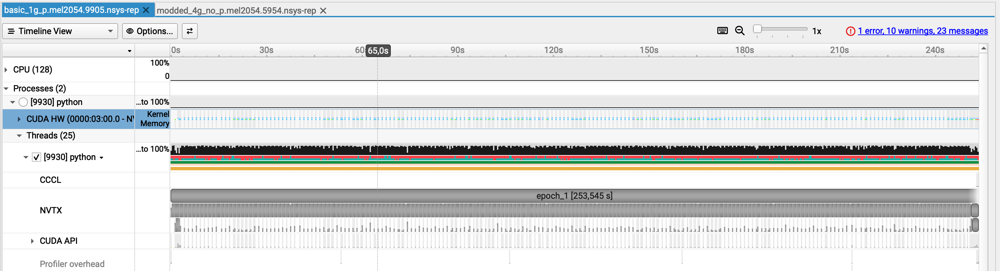
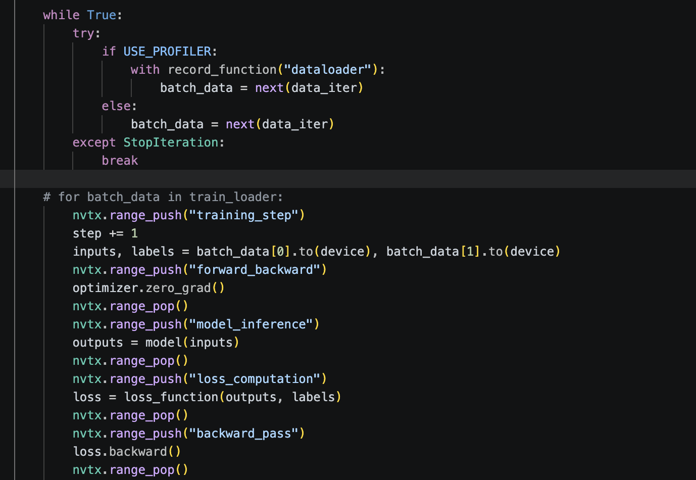
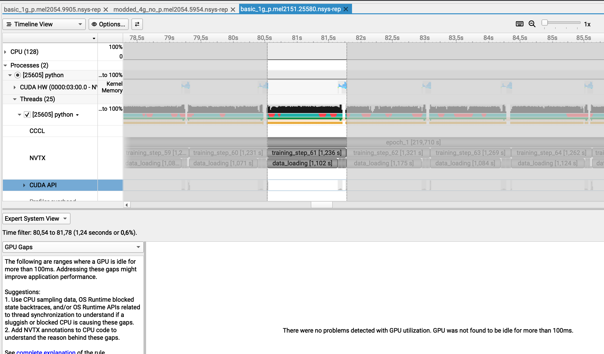
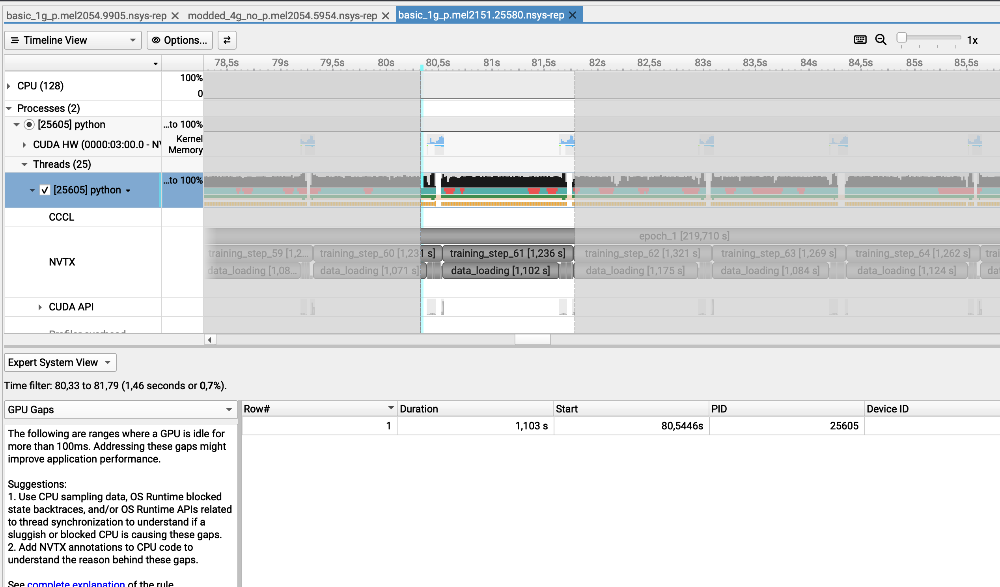
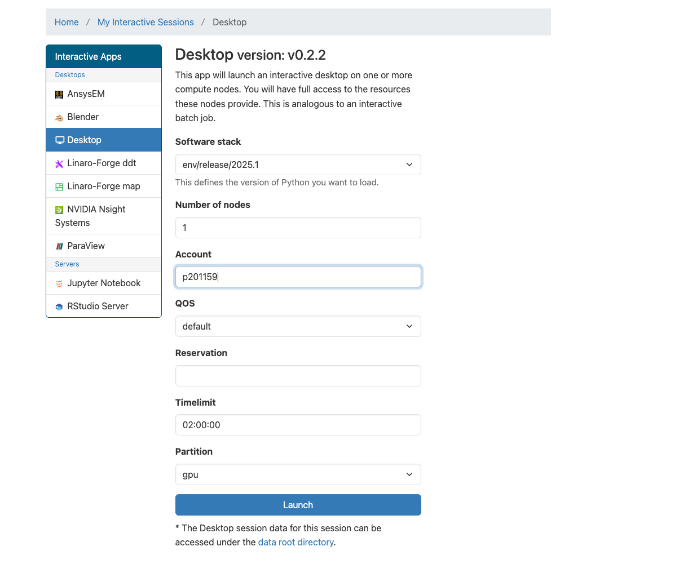

# Speakers


<!-- _footer:  -->

<!-- _class: lead -->

# Understanding why your GPU-accelerated is slow using NVIDIA Nsight Systems
Apr 15, 2026 | 1:20 PM - 3:00 PM


___
# Presenters 

<!-- _class: lead -->

<div class="speaker-row">
  
  
</div>

<div class="speaker-caption">
  Marco Magliulo &nbsp;&nbsp;|&nbsp;&nbsp; Tom Walter
</div>


---

# Goal of this workshop

By the end, you should be able to:

- Profile your GPU jobs on Meluxina
- Interpret key NSight-Systems trace metrics and timelines  
- Identify common GPU bottlenecks (IO, compute, memory, synchronization, communication)  
- Apply simple optimizations and validate improvements  

---

## Agenda 

- Connection to Meluxina via OpenOnDemand
- Introduction to NVIDIA NSight-Systems
- Hands-on: making a PyTorch Training faster

---

<!-- _class: lead -->

# Connecting to Meluxina via OpenOnDemand 


---
# https://portal.lxp.lu/


---
# Openning the Desktop app 



---
# Choosing the appropriate job options 


---
# Accessing the session



---
# Openning the terminal app




---

<!-- _class: lead -->

# Getting the code  


---
# Going to the project folder 


```bash
cd /project/home/p201259/workspaces/ 
mkdir -p $USER/
cd $USER/
```

---
# Cloning the repo

```bash
git clone https://github.com/LuxProvide/Scynergy2026-GPUApplicationProfiling
cd Scynergy2026-GPUApplicationProfiling/
```

---

<!-- _class: lead -->

# Why profiling? 

---

# Why Measuring/profiling GPU code?

- Wall‑clock runtime alone doesn’t explain *why* a job is slow
- GPU programming adds complexity:
  - Host ↔ device transfers
  - Kernel launches and occupancy
  - Memory hierarchy (global / shared / L2 / registers)


---
##  Typical Key Questions Answered via Profiling

- **CPU/IO Bottlenecks:** Is the GPU idle during data loading?
- **Compute vs. Memory:** bandwidth-bound or compute-bound?
- **Multi-GPU Scaling:** Is there load imbalance across ranks?
- **Sync Stalls:** Are MPI/NCCL/Barriers causing idleness?
- **Launch Overhead:** Are kernels too small or frequent?
- **Occupancy:** Is register/SRAM usage limiting parallelism?

---

# NVIDIA Nsight tool family

- **Nsight Systems**
  - System‑wide timeline (CPU, GPU, MPI, I/O)
  - Good for: *“Where is the time going?”*
- **Nsight Compute**
  - Kernel‑level analysis and metrics
  - Good for: *“Why is this kernel so slow?”*

Today focus on **Nsight Systems** 

---

# Usual workflow

1. **Reproduce the problem** with a smaller test case
2. Run **Nsight Systems** on this smaller test case
3. Identify **top time consumers** in the timeline
4. Formulate hypotheses → apply changes → re‑profile
5. Repeat until performance is satisfactory 


---

# High-level workflow: Running Nsight on MeluXina 

Two main steps:
- Nsight-Systems produces a trace (`.nsys-rep` extension)
- We use the GUI of Nsight-Systems and its command line tools to analyze this trace 

---

# What we will be using  

For the ease of use, we are going to use OpenOnDemand.
We will then be able to:
- Open `Nsight-Systems` GUI to analyze traces already prepared for you,
- We will also use the `nsys` command line tools

---

<!-- _class: lead -->

# Let's start  

--- 

# First step: setting up the environment

Open a terminal in your OOD session and run:

```bash
cd /project/home/p201259/workspaces/$USER/Scynergy2026-GPUApplicationProfiling/
cd Scripts
source setup_environment.sh
```

--- 
# Second step: let's open a trace

```bash
module load Nsight-Systems
THE_TRACE=/mnt/tier2/project/p201259/materials/15April_GPUApp_Profiling/ProfilingTraces/single_gpu_base.nsys-rep
nsys-ui $THE_TRACE
```

- Here we look at the trace corresponding to the code `Scripts/script_basic_1g.py`
- This is what you would get from a "naive" training code

--- 
# Second step: let's open a trace


___

# Let's have a closer look


---

# Zoom on a part of the timeline

Hover your mouse over a refion of interest by keeping the left button of your mouse pressed.




---
# Filter and zoom in




---
# Filter and zoom in


---
# Zooming further


---
# Identifying the culprit 


---
# Identifying the culprit 


---

# First observations

From the screenshot alone:
✅ GPU is poorly utilized
✅ Memory usage is stable but low
⚠️ Almost everything is on default stream
⚠️ Limited concurrent execution
✅ CPU is active, not idle
⚠️ Long GPU gaps in between the training steps   

___
# Side note 

In the GUI, you can select the analysis summary allows you to retrieve which command line you used to obtain the trace.
-> This can be very handy if you have a lot of traces 


---
# Let's dig into the command to generate the trace

```bash
srun ${SRUN_OPTIONS} nsys-profile ${NSYS_OPTIONS} ${TORCHRUN_COMMAND}
```

---

```
NSYS_OPTIONS="--cuda-memory-usage=true \
    --capture-range=cudaProfilerApi \
    --capture-range-end=stop \
    --output=${output_file} \
    -t cuda,nvtx"
```

- **`--cuda-memory-usage`**: Tracks VRAM footprint 
- **`--capture-range=cudaProfilerApi`**: Only profiles the code between `start()` and `stop()` calls in the python code 
- **`--output`**: Defines the path for the `.nsys-rep` file.
- **`-t cuda`**: Traces GPU kernels, memory copies, and API calls.
- **`-t nvtx`**: Traces user-defined code annotations (e.g., "Epoch 1", "Optimizer").


---
### We only profile what we need (when possible)

Those 2 flags:

```bash
--capture-range=cudaProfilerApi \
--capture-range-end=stop \
```
in conjunction with these functions:
```
import torch.cuda.profiler as profiler
profiler.start()
...
profiler.stop()
```

allow us to profile only what we need ! 

---

# Alternatives 

For collection, you can also reduce trace size and overhead with `--delay` and/or `--duration`


--- 

# Nsight Systems CLI

- once you have your `.nsys-rep`, you can also use the CLI to post-process the profiling output
- `nsys` can post-process existing `.nsys-rep` or SQLite results using `stats`, `analyze`, `export`, and `recipe`

---

# Nsight Systems CLI

- Start with `nsys stats` for quick summaries in the terminal. 
- Use `nsys analyze` for an expert-systems style report.
- Use `nsys export` to create export files from an existing `.nsys-rep`. This allows to post-process traces programatically (with SQL for instance)
- Use `nsys recipe` for statistical analysis and plots across one or more reports. 

---

# Fastest entry point: `nsys stats`

```bash
nsys stats myrun.nsys-rep
```

---


<!-- _class: lead -->

# Your turn to look at a trace 

---

<!-- _class: lead -->

What if we try something brute force and just increase the number of GPUs used i? 

---

# Foreword

run the following: 

```bash
module load Nsight-Systems
THE_TRACE=/mnt/tier2/project/p201259/materials/15April_GPUApp_Profiling/ProfilingTraces/multigpus_base.nsys-rep
nsys-ui $THE_TRACE
```

---
## Observations


---
## Observations

- We knew that the problem was not coming from the GPU usage when using 1 GPU 
- Still, we wanted to see if using 4 GPUs would reduce the training time 
- still a lot of gaps in the individual activity of the GPU in the distributed training
- single GPU: 217 sec for the epoch
- 4 GPUs: 179 sec

⚠️ 4x more GPU power but 18% improvement in runtime 

---

<!-- _class: lead -->
## What can kill the performance that much ? 

<!-- _class: lead -->

# Your turn to investigate 

---

## Starting point 

```bash
cd /project/home/p201259/workspaces/$USER/Scynergy2026-GPUApplicationProfiling/Script
```

---
## Code to use 

- Python script: `script_modded_4g.py`
- Launcher: `source launcher_modded_4g_p.sh`

To launch the script **from the OpenOnDemand** terminal:

```bash
source launcher_modded_4g_p.sh 
```

---
## Openning the trace

```bash
sys-rep
train completed, best_metric: 0.8383 at epoch: 1
Generated:
        .../modded_4g_no_p.mel2129.24037.nsys-rep
```

Get the path of the ``.nsys-rep`` file and open it with:

```bash
nsys-ui $THEPATH.nsys-rep
```

---

## Example of improved script trace 


---

## Wrapping things up 

- 1 GPU - base script - 217 seconds
- 4 GPUs - base script - 189 seconds
- 4 GPUs - improved script - 9 seconds 

---

# Recap of the workflow when you need to improve your code performance 

1. Prepare a **representative but smaller** test case if the code is too long to execute  
2. Run Nsight Systems for a **global view** on the base script
3. Identify the 2–3 main bottlenecks from the trace
4. Implement optimizations → re‑run profiling 
5. Carefully review what you have changed. Try not to change only one thing at a time 
6. Ensure that your modifications did not affect the code functionnality (for example convergence of training)
7. Once satisfied, scale back up to full production sizes. 


---

# What you can do after this workshop

- Apply Nsight to your **own applications** on MeluXina to produce traces  

```bash
srun ${SRUN_OPTIONS} nsys-profile ${NSYS_OPTIONS} ${YOURBIN}
```

- Performance optimization guided by profiling results 

---

# Q & A

Questions, specific applications, or issues you’d like to discuss?

---

# Thank you

- Useful resources:
  - [NSight documentation](https://docs.nvidia.com/nsight-systems/UserGuide/index.html)
  - [Meluxina Documentation](https://docs.lxp.lu/)

- Contact:  
  - servicedesk [at] lxp.lu


---

<!-- _class: lead -->

# Back-up slides  

---

# Meluxina GPU node Hardware 

- CPU: 2× AMD 7452 EPYC ROME CPUs: 32 cores each
- GPUs:
    - 4× NVIDIA A100 GPUs on each node
      - 40 GB HBM2 each (the so-called VRAM)
    - NVLink between GPUs **of the same node**
- ~512 GB RAM 

---

# Meluxina GPU node Hardware 

- Storage / FS
    - Parallel filesystem (Lustre) for scratch/project storage
    - Local SSD for node‑local temporary data ~1.8 Tb 
- High‑speed HDR/InfiniBand (200 Gb/s ) between nodes

---

# Zoom on a dataloading part of the training 

