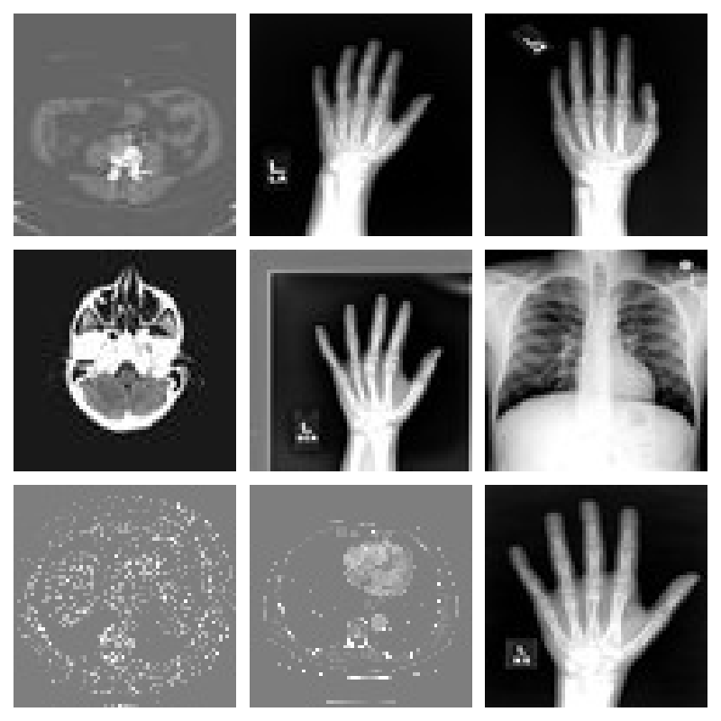
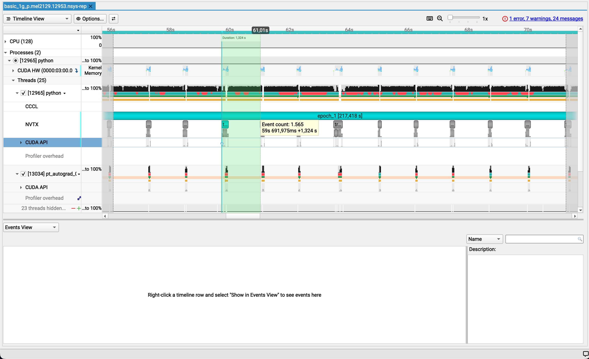
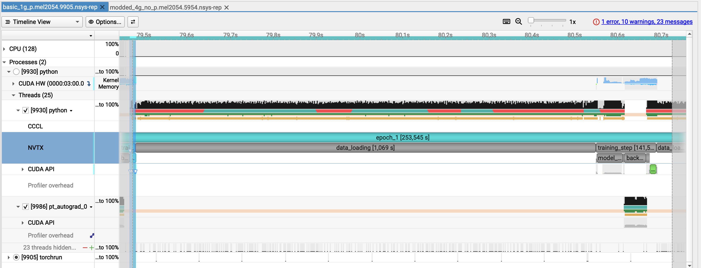
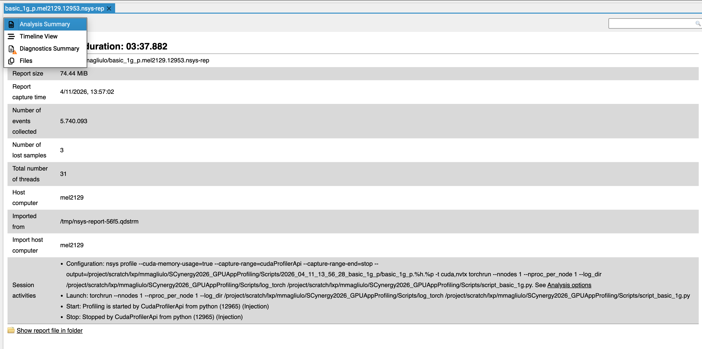

# GPU Profiling on MeluXina

## Intro

### Why Measuring/profiling GPU code?

- Wall‑clock runtime alone doesn’t explain *why* a job is slow
- GPU programming adds complexity:
  - Host ↔ device transfers
  - Kernel launches and occupancy
  - Memory hierarchy (global / shared / L2 / registers)
  - NCCL communication


###  Typical Key Questions Answered via Profiling


Profiling helps identify where time and resources are actually spent during execution. Common questions it can answer include:


- CPU - I/O Bottlenecks
Is the GPU frequently idle while waiting for data loading, preprocessing, or host-side work?

- Compute vs. Memory Behavior
Is application performance limited by computational throughput, or by memory bandwidth and data movement?

- Multi‑GPU Scaling (when applicable)
Are all GPUs and ranks doing comparable amounts of work, or is load imbalance reducing scalability?

- Synchronization Overhead
Are MPI, NCCL operations, or synchronization barriers causing GPUs to stall or wait unnecessarily?

- Kernel Launch Overhead
Is performance affected by launching many small or short-lived kernels?

- GPU Utilization and Occupancy
Are register pressure, shared memory usage, or low occupancy limiting available parallelism?

### Usual workflow

0. **You have a possible performance issue** with time-consuming app/workflow
1. **Reproduce the problem** with a shorter test case
2. Run iyour Profiler on this smaller test case
3. Identify **top time consumers** in the timeline
4. Formulate hypotheses → apply changes → re‑profile
5. Repeat until performance is satisfactory 

### NVIDIA Nsight tool family

- **Nsight Systems**
  - System‑wide timeline (CPU, GPU, MPI, I/O)
  - Good for: *“Where is the time going?”*
- **Nsight Compute**
  - Kernel‑level analysis and metrics
  - Good for: *“Why is this kernel so slow?”*

Today focus on **Nsight Systems** 

### High-level workflow when using Nsight

Two main steps:
- Producing a trace with Nsight-Systems (`.nsys-rep` extension)
- Post-process the output with the Nsight-Systems GUI and its command line tools to analyze this trace 


## Openning your first trace


### A short word on what we will look at 

Today's workshop is about [MonAI](https://project-monai.github.io/) training

More specifically, we will work on the training of a classification model aimed at classifying medical images:




### First step: setting up the environment

Open a terminal in your OOD session and run:

```bash
cd /project/home/p201259/workspaces/$USER/Scynergy2026-GPUApplicationProfiling/
cd Scripts
source setup_environment.sh
```

### Second step: openning a trace  

```bash
module load Nsight-Systems
nsys-ui $TRACE_1GPU_BASE
```

- Here we look at the trace corresponding to the code `Scripts/script_basic_1g.py`
- This is what you would get from a "naive" training code running on one GPU only 


### Let's have a closer look


### Zoom on a part of the timeline

Hover your mouse over a region of interest by keeping the left button of your mouse pressed.


Right click and select "Filter and Zoom in"


Look at the timeline! 


### Zooming further

Only select one repetition of the pattern we see all along the epoch and let's have a look

x

### Identifying the culprit 




---

### First observations

From the screenshot alone:
✅ GPU is poorly utilized
✅ Memory usage is stable but low
⚠️ Almost everything is on default stream
⚠️ Limited concurrent execution
✅ CPU is active, not idle
⚠️ Long GPU gaps in between the training steps   
⚠️ It is clear that the dataloader is the culprit 

___
### Side note 

In the GUI, you can select the analysis summary allows you to retrieve which command line you used to obtain the trace.
-> This can be very handy if you have a lot of traces 





---
### Let's dig into the command to generate the trace

```bash
nsys-profile ${NSYS_OPTIONS} ${TORCHRUN_COMMAND}
```


```bash
NSYS_OPTIONS="--cuda-memory-usage=true \
    --capture-range=cudaProfilerApi \
    --capture-range-end=stop \
    --output=${output_file} \
    -t cuda,nvtx"
```

- **`--cuda-memory-usage`**: Tracks VRAM footprint 
- **`--capture-range=cudaProfilerApi`**: Only profiles the code between `start()` and `stop()` calls in the python code 
- **`--output`**: Defines the path for the `.nsys-rep` file.
- **`-t cuda`**: Traces GPU kernels, memory copies, and API calls.
- **`-t nvtx`**: Traces user-defined code annotations (e.g., "Epoch 1", "Optimizer").


### Only profile what is needed (when possible)

Those 2 flags:

```bash
--capture-range=cudaProfilerApi \
--capture-range-end=stop \
```

in conjunction with these functions in your python script:

```python
import torch.cuda.profiler as profiler
profiler.start()
...
profiler.stop()
```

allow us to profile only what we need ! 


#### Other useful options 

For collection, you can also reduce trace size and overhead with `--delay` and/or `--duration`


## Nsight Systems CLI

- once you have your `.nsys-rep`, you can also use the CLI to post-process the profiling output
- `nsys` can post-process existing `.nsys-rep` or SQLite results using `stats`, `analyze`, `export`, and `recipe`

### Main commands 

- `nsys stats` → generate statistical summaries 
- `nsys analyze` → generate an expert-systems report 
- `nsys export` → generate an export file from an existing `.nsys-rep`. 


#### `nsys stats`
 
```bash
nsys stats report.nsys-rep
```

*   `nsys stats` is the quickest way to get useful text summaries from a saved report. 
*   It accepts either `.nsys-rep` or SQLite input.

##### Example

We can filter by `nvtx` range which is very handy to only focus on a `nvtx` range 

```bash
$ nsys stats --force-overwrite --filter-nvtx=training_step/10  $TRACE_1GPU_BASE 

NOTICE: Existing SQLite export found: single_gpu_base.sqlite
        It is assumed file was previously exported from: single_gpu_base.nsys-rep
        Consider using --force-export=true if needed.

Processing [single_gpu_base.sqlite] with [/mnt/tier2/apps/USE/easybuild/release/2025.1/software/Nsight-Systems/2025.3.1/host-linux-x64/reports/nvtx_sum.py](nvtx=training_step/10)... 

 ** NVTX Range Summary (nvtx_sum):

 Time (%)  Total Time (ns)  Instances      Avg (ns)           Med (ns)          Min (ns)         Max (ns)      StdDev (ns)   Style         Range      
 --------  ---------------  ---------  -----------------  -----------------  ---------------  ---------------  -----------  -------  -----------------
     99.0  674,481,948,315          1  674,481,948,315.0  674,481,948,315.0  674,481,948,315  674,481,948,315          0.0  PushPop  :epoch_1         
      0.5    3,395,466,394          1    3,395,466,394.0    3,395,466,394.0    3,395,466,394    3,395,466,394          0.0  PushPop  :training_step   
      0.5    3,088,019,032          1    3,088,019,032.0    3,088,019,032.0    3,088,019,032    3,088,019,032          0.0  PushPop  :data_loading    
      0.0      161,093,381          1      161,093,381.0      161,093,381.0      161,093,381      161,093,381          0.0  PushPop  :model_inference 
      0.0      123,023,037          1      123,023,037.0      123,023,037.0      123,023,037      123,023,037          0.0  PushPop  :backward_pass   
      0.0        8,343,032          1        8,343,032.0        8,343,032.0        8,343,032        8,343,032          0.0  PushPop  :optimizer_step  
      0.0        1,868,965          1        1,868,965.0        1,868,965.0        1,868,965        1,868,965          0.0  PushPop  :forward_backward
      0.0        1,716,235          1        1,716,235.0        1,716,235.0        1,716,235        1,716,235          0.0  PushPop  :loss_computation
```

BUT ... unfortunately the "parent" nvtx ranges are taken into account in the computations of the relative time. 

Here we have all the reports that are generated but we can ask for some specific ones.

For most GPU/HPC work, I’d start with these:


- `nsys stats --report nvtx_sum` → phase-level timing from your annotations 
- `nsys stats --report cuda_gpu_mem_time_sum` → How much GPU time is being spent on memory operations instead of kernels?
- `nsys stats --report cuda_gpu_kern_sum:base` →  tells you where GPU compute time goes
- `nsys stats --report cuda_kern_exec_sum:base` → tells you more than just kernel runtime: it summarizes the full launch-to-execution path for each kernel launch, including API time, queue time, kernel time, and total time
- `nsys stats --report cuda_api_sum` → CPU launch/API overhead
- `nsys stats --report osrt_sum` → time blocked in host runtime/syscalls (for this one you must use `nsys profile -t osrt`)
- `nsys stats --report cuda_gpu_trace` → an event-by-event trace view for GPU-side CUDA work: instead of aggregating by kernel name like a summary report, it lists individual CUDA kernels and memory operations in time order.

You can have a great control over what you want to measure from the command line.
For instance, if you want to have a look at the 10 most time-consumer CUDA kernel  

```bash
$ nsys stats  --quiet  --force-overwrite   --filter-nvtx=training_step/10   --report cuda_gpu_trace   --format csv   --output -   single_gpu_base.nsys-rep | python3 -c '
import csv, sys
rows = list(csv.DictReader(sys.stdin))
print(rows)
rows.sort(key=lambda r: float(r["Duration (ns)"]), reverse=True)
w = csv.DictWriter(sys.stdout, fieldnames=rows[0].keys())
w.writeheader()
w.writerows(rows[:10])
' > top10_cuda_gpu_trace.csv
```

#### Multiple reports and machine-readable output

You can generate multiple reports at once:

```bash
nsys stats \
  --report cuda_gpu_trace \
  --report cuda_gpu_kern_sum \
  --report cuda_api_sum \
  --format csv,column \
  --output .,- \
  report.nsys-rep
```

#### GOTCHAS

Missed GPU gaps


Strangely enough, a GPU gap is detected only if the selected range is between two GPU utilization chunks

Here I selected another chunk where the GPU is being used and the GPU gap is detected...


However, if I generate a report from the command line, this can be really misleading as we totally miss that the GPU is idle

```bash
$ nsys analyze --filter-nvtx=training_step_67 --rule gpu_gaps basic_1g_p.mel2151.25580.nsys-rep 

NOTICE: Existing SQLite export found: basic_1g_p.mel2151.25580.sqlite
        It is assumed file was previously exported from: basic_1g_p.mel2151.25580.nsys-rep
        Consider using --force-export=true if needed.

Processing [basic_1g_p.mel2151.25580.sqlite] with [/mnt/tier2/apps/USE/easybuild/release/2025.1/software/Nsight-Systems/2025.3.1/host-linux-x64/rules/gpu_gaps.py](nvtx=training_step_67)... 

 ** GPU Gaps (gpu_gaps):

There were no problems detected with GPU utilization. GPU was not found to be
idle for more than 500ms.

Processing [basic_1g_p.mel2151.25580.sqlite] with [/mnt/tier2/apps/USE/easybuild/release/2025.1/software/Nsight-Systems/2025.3.1/host-linux-x64/rules/gpu_time_util.py](nvtx=training_step_67)... 
```

As you can see we get:


<pre><code><span style="background-color: #ffeb3b; color: black; font-weight: bold;">GPU Gaps (gpu_gaps):</span>
There were no problems detected with GPU utilization. GPU was not found to be
idle for more than 500ms.
</code></pre>


