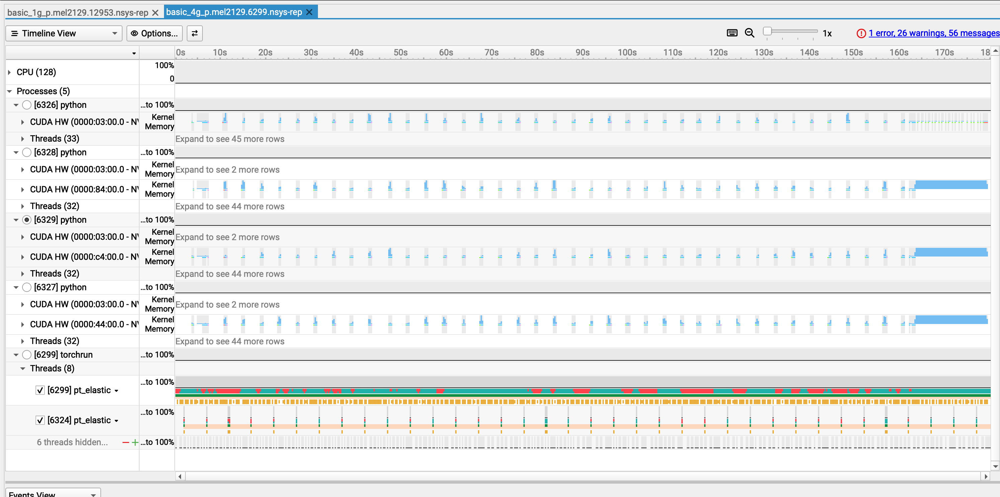
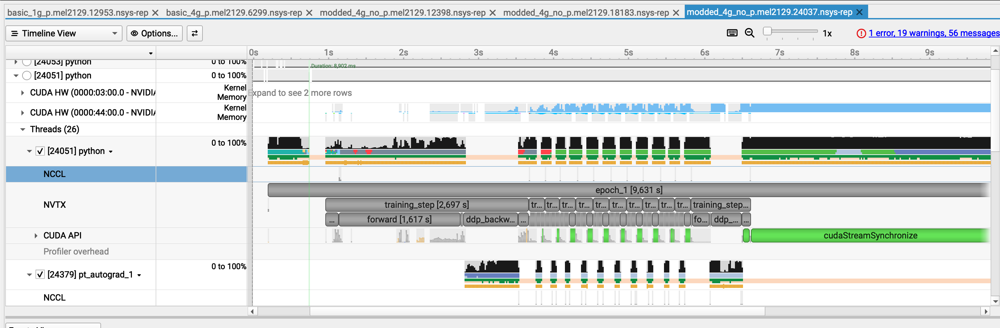
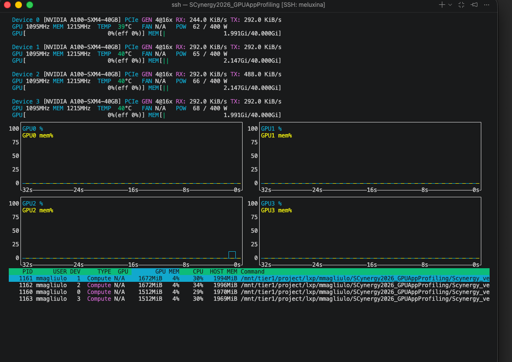
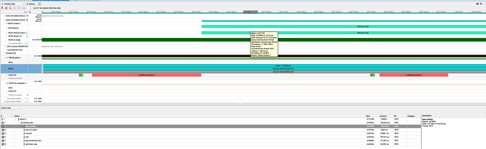

# Your turn to look at a trace

This time, you are in command.
You will do two things:

- open a trace of the same training but distributed on 4 GPUs and analyze it
- profile a better performing code, open the trace, experiment what happens when the parameters are being changed

## What if we try something brute force and just increase the number of GPUs used i?

Still from your OpenOnDemand terminal run the following:

```bash
nsys-ui $TRACE_4GPU_BASE
```

Your Nsight-systems UI should look like this:



- Let's take 10 minutes for you to play around with this trace and then we will debrief  

## Observations

- We knew that the problem was not coming from the GPU usage when using 1 GPU
- Still, we wanted to see if using 4 GPUs would reduce the training time
- Obviously, still a lot of gaps in the individual activity of the GPU in the distributed training
- We just duplicated the problem

| Configuration | Time per Epoch | Speedup vs. 1 GPU | Scaling Efficiency |
| --- | ---: | ---: | ---: |
| 1 GPU | 217 s | 1.00× | 100.0% |
| 4 GPUs | 179 s | 1.21× | 30.3% |

At this point we can state that:

- ⚠️ 4x more GPU power but 21% speedup only  
- ⚠️ My ennemy is still the same: the dataloader  

---

## What to change to improve performances

### Your turn to investigate

- This time you are totally in command. You will
  - collect a trace
  - analyze it
  - find what is/are the bottleneck(s)
  - modify the code accordingly

---

### Starting point


```bash
cd /project/home/p201259/workspaces/$USER/Scynergy2026-GPUApplicationProfiling/Script
```

- Python script to modify: `script_modded_4g.py`
- Launcher to modify: `source launcher_modded_4g_p.sh`

In particular, play with the following variables

```bash
export BATCH_SIZE=...
export NUM_WORKERS=...
export PRE_FETCH_FACTOR=...
```

To launch the script **from the OpenOnDemand** terminal:

```bash
bash launcher_modded_4g_p.sh 
```

<div style="background-color:#ffeeba; padding:10px; border-left:5px solid #f0ad4e;">
<strong>⚠️ Warning</strong><br>
The performance in OpenOnDemand are lower than the one you would get from a standard `salloc` interactive session or via `sbatch`

If possible, try to run the script **outside** of OpenOnDemand.
</div>

---

### Openning the trace

```bash
sys-rep
train completed, best_metric: 0.8383 at epoch: 1
Generated:
        .../modded_4g_no_p.mel2129.24037.nsys-rep
```

Get the path of the ``.nsys-rep`` file and open it with:

```bash
nsys-ui $THEPATH.nsys-rep
```

---

## Example of trace with improved execution time



## Conclusion

### What we changed in the code to make it more efficient

#### Diagnostic

- We analyzed the trace, identified the main bottleneck, and then applied changes, if possible **one by one** ! If you don't do this you might miss what is truly changing your performance  
- In the case we presented, the problem was obvious because:
  - with `nvtx` ranges we identified what specific part of the training loop was the issue
  - we had large GPU gaps at every step
- During the dataloading, we hypothetized that either the CPU was doing something to the data before the GPU could work on it, or it was due to slow I/O.

#### Changes  

With the previous diagnostic in mind we made the following changes:

- Use the **`CacheDataset`** of MonAI.
- Tweak the dataloader: we increased the number of workers that PyTorch uses.
- Included Test **pinning / non-blocking copies**,

##### Explanation of the changes (the most interesting bit)

**`CacheDataset`**
By using this, and if you have enough RAM to do so, your transformed Dataset goes onto the RAM.
    - launching your training is longer but afterwards your perf. gains are substantial
    - your dataset is fetched from the RAM and not from the filesystem!



Caching the Dataset consume some memory on the host RAM but not the GPU VRAM !

**Tweaking the `Dataloader`**

- `num_workers` controls how many CPU **processes** PyTorch’s DataLoader uses to prepare batches in parallel.
- with `num_workers=0`, everything runs in the main process → slow and blocking
- with `num_workers` being too high, there might be high RAM usage

**Pinning memory**

```python
DataLoader(..., pin_memory=True)
```

**Non-blocking copies**

```python
images = images.to(device, non_blocking=True)
```

Allows the CPU to GPU transfer to happen asynchronously:

-> With pinned memory and non-blocking copies, data transfer overlaps computation

The gains important with this trick when:

- this is impactful when having large batches like 3D images (here batches are rather small)
- CPU processing is not the bottleneck

### Investigate your memory transfer (AWESOME)

You want to know more about your datatransfer?
It's possible with NSight


If you select the event on the timeline and open the stats menu you can see something like this:



What are those 16 Mb?
Let's think about it"

- From MedNIST, a single 64×64 PNG is `64 × 64 × 1 byte = 4096 bytes ≈ 4 kB`
- I used batches of 4096 images:  `1024 × 16 kB = 16384 kB ≈ 16 MB`

This is exaclty what we see on the GUI

### Key takeaways (in one glance)

| Scenario               | Script version  | # GPUs | Batch size | Time per epoch      |
| ---------------------- | --------------- | ------ | ---------- | ------------------- |
| Baseline               | Initial script  | 1 GPU  | Small      | **217 s / epoch**   |
| Parallel (inefficient) | Initial script  | 4 GPUs | Small      | **\~180 s / epoch** |
| Optimized              | Modified script | 4 GPUs | Medium     | **\~9 s / epoch**   |

- **1 → 4 GPUs without code changes** gives only a **modest speedup**  
    (217 → \~180 s): scaling limited by input pipeline, batch size, and inefficiencies.

- **Script + batch size optimization** unlocks the hardware:
  - better GPU utilization
  - Proper data pipeline overlap
  - Better gpU usage

- End result:
  - **≈ 24× faster** than the original 1‑GPU baseline
  - **≈ 20× faster** than the naïve 4‑GPU run

## Why profiling still mattered

Without the trace, we could easily have optimized the wrong thing:

- tried to scale to more GPUs too early (we did this intentionnally)
- focused on CUDA micro-optimizations first
- blamed distributed training before understanding the single-GPU case

### Recap of the workflow when you need to improve your code performance

1. Prepare a **representative but smaller** test case if the code is too long to execute  
2. Run Nsight Systems for a **global view** on the base script
3. Identify the 2–3 main bottlenecks from the trace
4. Implement optimizations → re‑run profiling
5. Carefully review what you have changed. Try not to change only one thing at a time
6. Ensure that your modifications did not affect the code functionnality (for example convergence of training)
7. Once satisfied, scale back up to full production sizes.

---

## What you can do after this workshop

- Apply Nsight to your **own applications** on MeluXina to produce traces  

    ```bash
    nsys-profile ${NSYS_OPTIONS} ${YOURBIN}
    ```

    or if `srun` is available (outside of OpenOnDemand):

    ```bash
    srun ${SRUN_OPTIONS} nsys-profile ${NSYS_OPTIONS} ${YOURBIN}
    ```

- Performance optimization guided by profiling results

---

## Q & A

Questions, specific applications, or issues you’d like to discuss?

---

## Thank you

- Useful resources:
  - [NSight documentation](https://docs.nvidia.com/nsight-systems/UserGuide/index.html)
  - [Meluxina Documentation](https://docs.lxp.lu/)

- Contact:  
  - servicedesk [at] lxp.lu

<!-- 
---

# Meluxina GPU node Hardware 

- CPU: 2× AMD 7452 EPYC ROME CPUs: 32 cores each
- GPUs:
    - 4× NVIDIA A100 GPUs on each node
      - 40 GB HBM2 each (the so-called VRAM)
    - NVLink between GPUs **of the same node**
- ~512 GB RAM 

---

# Meluxina GPU node Hardware 

- Storage / FS
    - Parallel filesystem (Lustre) for scratch/project storage
    - Local SSD for node‑local temporary data ~1.8 Tb 
- High‑speed HDR/InfiniBand (200 Gb/s ) between nodes

---

# Zoom on a dataloading part of the training 

 -->