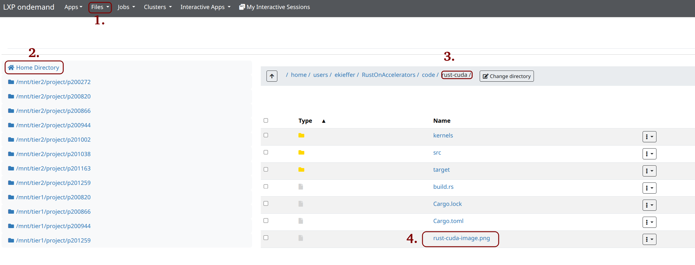
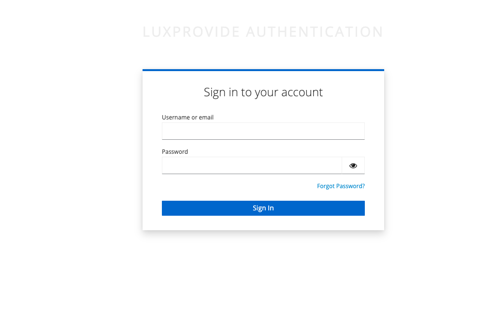
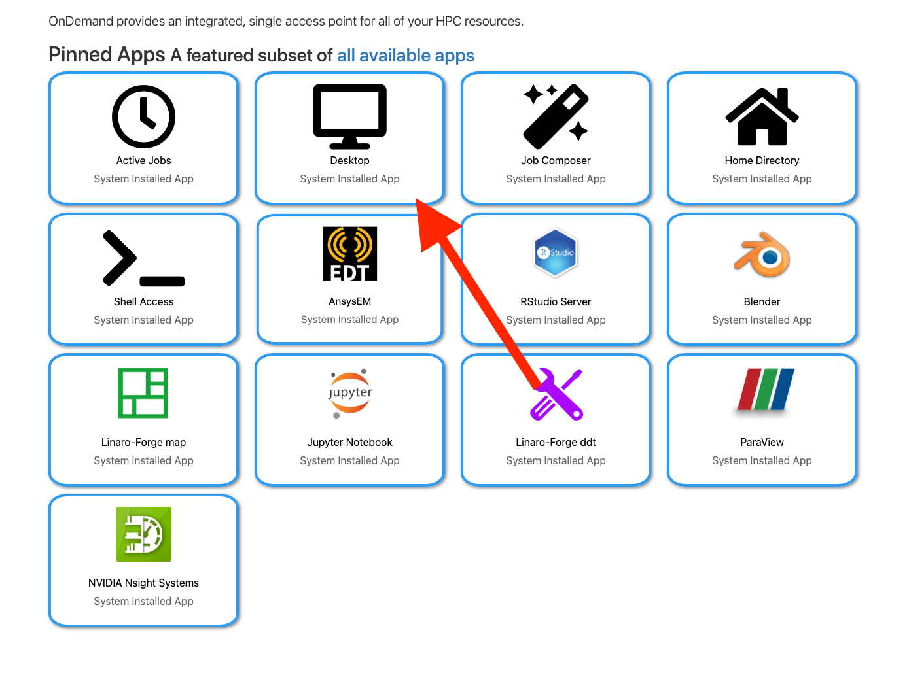
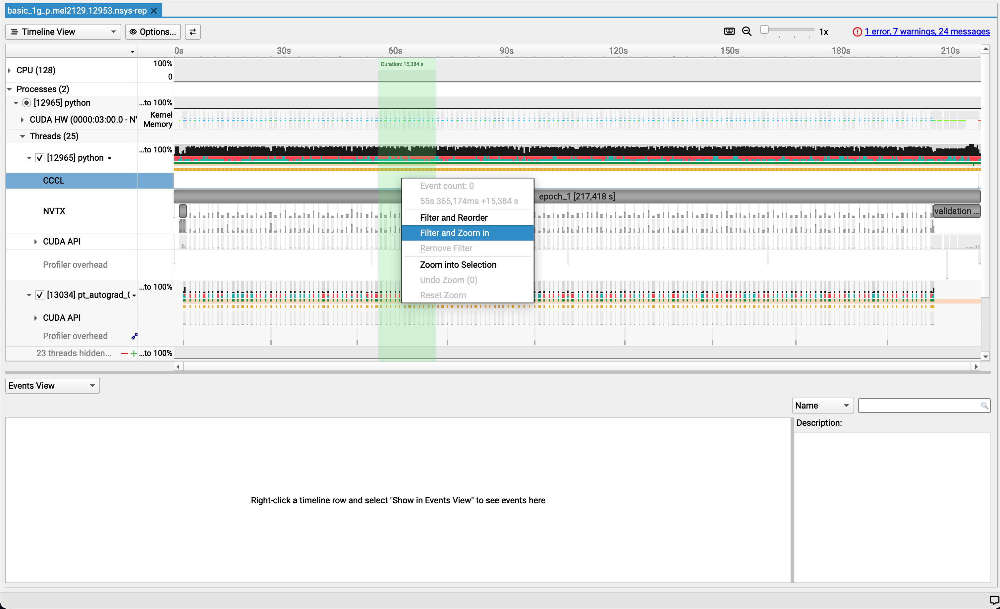

# Setting things up

This short guide explains how to connect to **MeluXina** using **OpenOnDemand**, start a remote desktop session, open a terminal, and retrieve the tutorial code for the profiling exercises.

The goal of this setup is to provide you with an interactive **GPU-enabled** environment where you can run and profile applications with graphical and command-line tools.


---
## OpenOnDemand

### Open the OpenOnDemand portal

Open your web browser and navigate to the MeluXina OpenOnDemand portal:


**https://portal.lxp.lu/**

<!--  -->



Log in with your credentials.  

After successful authentication, you will be redirected to the OpenOnDemand home page. From here, you can launch interactive applications such as terminals, notebooks, and full remote desktop sessions. For this tutorial, we will use the Desktop application, which provides a complete Linux desktop environment.


---

### Opening the Desktop app

From the OpenOnDemand landing page, open the **Interactive Apps** menu and select the **Desktop** application.




This application allows you to start a graphical remote session on MeluXina, which is useful for running tools that require a desktop environment.

---

### Choosing the appropriate job options

Configure the desktop job with the appropriate parameters for the tutorial.
See also [here](https://luxprovide.github.io/SCynergy2026-GettingStartedWithMeluXina/urban_wind_simulation/#open-paraview)




Recommended settings:
- 1 node
- Account: `p201259`    
- QOS: `default`
- Timelimit: `02:00:00`
- Partition: `gpu`

--> Do not forget to press the launch button

Once the job is submitted, OpenOnDemand will queue it and prepare your interactive environment.

---

### Accessing the session

After the job starts, OpenOnDemand will show it under My Interactive Sessions.
Click **Launch Desktop** to connect to your session.


This will open a browser-based desktop connected to the allocated MeluXina resources.
No other software is required on your local machine ! 

---

### Opening the terminal app

Inside the remote desktop session, open a terminal window.


The terminal will be used for all command-line operations in this tutorial, including navigating directories, cloning the repository, and running profiling commands.

---

## Cloning the repo

### Going to the project folder

In the next steps, we will prepare a workspace and download the tutorial material from LuxProvide GitHub.

In the terminal app you openned, create a personal working directory inside the shared project workspace and move into it.

```bash
cd /project/home/p201259/workspaces/
mkdir -p $USER/
cd $USER/
```

### Cloning 

Next, clone the training repository containing the code:

```bash
git clone https://github.com/LuxProvide/Scynergy2026-GPUApplicationProfiling
cd Scynergy2026-GPUApplicationProfiling/
```

After this step, you should have access to all files needed for the tutorial, including source code, examples, and profiling material.

You are now ready to continue with the hands-on exercises.


## Next steps
You are now fully set up with:

An interactive GPU-enabled desktop session
Access to the tutorial source code
A working terminal environment