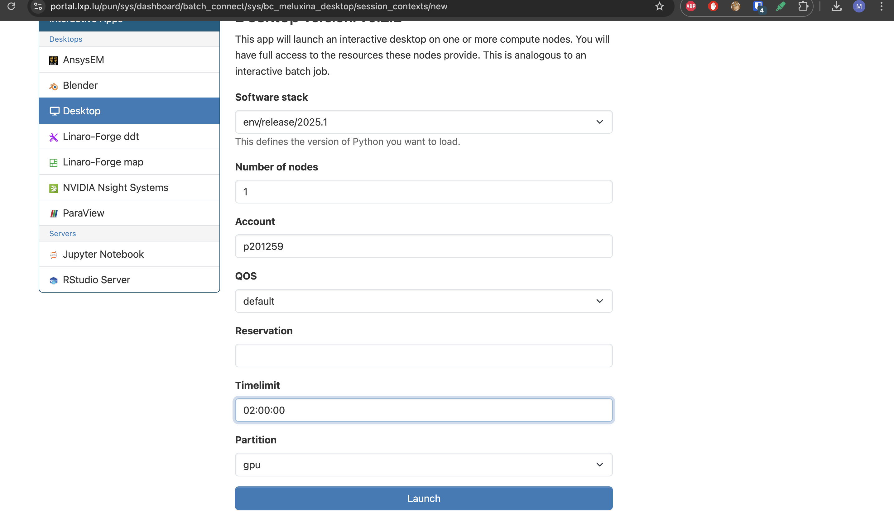
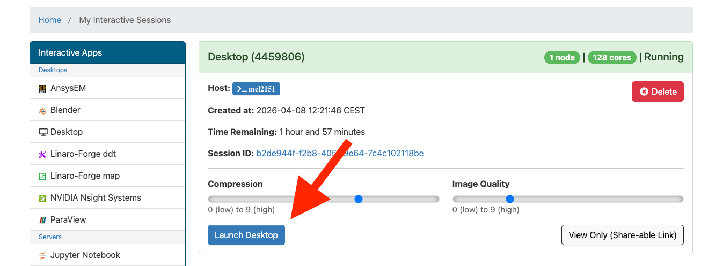

# Setting things up

This short guide explains how to connect to **Meluxina** using **OpenOnDemand**, start a remote desktop session, open a terminal, and retrieve the tutorial code for the profiling exercises.

---

# Open the OpenOnDemand portal

Go to the Meluxina OpenOnDemand portal in your browser:

**https://portal.lxp.lu/**


Log in with your credentials.  
Once authenticated, you will reach the OpenOnDemand home page, where you can launch interactive applications such as a remote desktop session which is the app we will be using.

---

# Opening the Desktop app

From the OpenOnDemand landing page, open the **Interactive Apps** menu and select the **Desktop** application.


This application allows you to start a graphical remote session on Meluxina, which is useful for running tools that require a desktop environment.

---

# Choosing the appropriate job options

Configure the desktop job with the appropriate parameters for the tutorial.



Recommended settings:
- 1 node
- Account: `p201259`    
- QOS: `default`
- Timelimit: `02:00:00`
- Partition: `gpu`

--> Do not forget to press the launch button

Once the job is submitted, OpenOnDemand will queue it and prepare your interactive environment.

---

# Accessing the session

After the job starts, click **Launch Desktop** (or the corresponding button shown in the interface) to open your remote session in the **My Interactive Session** tab.



This will open a browser-based desktop connected to the allocated Meluxina resources.

---

# Opening the terminal app

Inside the remote desktop session, open a terminal window.


The terminal will be used for all command-line operations in this tutorial, including navigating directories, cloning the repository, and running profiling commands.

---

# Going to the project folder and Getting the code

In the next steps, we will prepare a workspace and download the tutorial material from LuxProvide GitHub.

In the terminal app you openned, create a personal working directory inside the shared project workspace and move into it.

```bash
cd /project/home/p201259/workspaces/
mkdir -p $USER/
cd $USER/
```

# Cloning the repository

Clone the training repository and move into the project folder:

```bash
git clone https://github.com/LuxProvide/Scynergy2026-GPUApplicationProfiling
cd Scynergy2026-GPUApplicationProfiling/
```

After this step, you should have access to all files needed for the tutorial, including source code, examples, and profiling material.

You are now ready to continue with the hands-on exercises.
